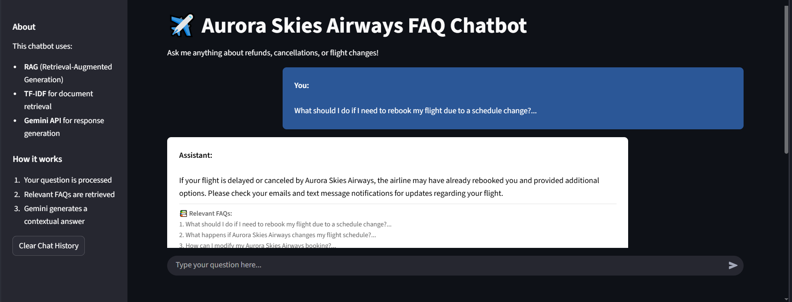

# ✈️ Arora Airline FAQ Chatbot

An intelligent chatbot powered by Google's Gemini AI model that answers airline-related queries using Retrieval-Augmented Generation (RAG). The chatbot provides accurate responses by referencing a curated database of airline FAQs, combining the power of AI with reliable information.

## Screenshot

## 🚀 Getting Started

### 1. Clone the repository
git clone <repository-url>

### 2. Instal Packages
pip install -r requirements.txt

### 3. Configure environment variable 
Create a .env file in the project root
Add your Google API key:
GOOGLE_API_KEY=your_api_key_here

### 4. Run the Applucation
Command => chainlit run app.py

5. Open your browser and navigate to http://localhost:8000

